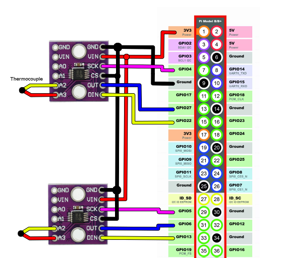

# ADS1118
A python interface to bit bang the ADS1118 chip from a Raspberry Pi. Single shot mode only for now. Optimized for my use: reading a temperature from a type K thermocouple.

The [ADS118](http://www.ti.com/lit/ds/symlink/ads1118.pdf) uses the SPI protocol. Since the SPI pins on my Raspberry Pi were occupied by the touch screen, this library uses normal GPIO pins instead (ie "bit bang"). 

## Using a single chip

Example use: read and print the temperature from a type K thermocouple connected to A2 and A3, once per second:

```python
import time
import ADS1118

# create the config registers
int_temp = ADS1118.encode(single_shot=True, temp_sensor=True, data_rate=5) # internal temperature
tc = ADS1118.encode(single_shot=True, multiplex=3, gain=7, data_rate=5) # thermocouple connected to A2/A3

ads = ADS1118.ADS1118(SCLK=4, DOUT=27, DIN=22) # set the GPIO pins

while True:
    start = time.time()
    ref_temp, tc_voltage = ads.read(int_temp, tc) # read data
    temp = ADS1118.TC_linearize(ref_temp, tc_voltage) # convert to temperature
    print("thermocouple temperature is {:.2f}°C (took {:.4f} ms)".format(temp, (time.time()-start)*1000.))
    time.sleep(1)
```

It would be wired like this:


## Using more than one chip with common data lines
More than one ADS1118 chip can use the data lines if you use a CS line for every chip. The CS line specifys which chip is currently active. Be sure that you don't try to read from more than one chip at a time. 

```python
chip1 = ADS1118.ADS1118(SCLK=4, DOUT=27, DIN=22, CS=17)
chip2 = ADS1118.ADS1118(SCLK=4, DOUT=27, DIN=22, CS=23)
```


## Using more than one chip with independant data lines
You can also assign data lines to each chip. This is useful if you want to read data from both at the same time. 

```python
chip1 = ADS1118.ADS1118(SCLK=4, DOUT=27, DIN=22)
chip2 = ADS1118.ADS1118(SCLK=5, DOUT=6, DIN=13)
```


## Notes
* the datasheet has config variables in binary. i.e. a data rate of 250 SPS is listed as "101", which is 5 in decimal. So you need to use `5` or specify binary with `0b101`. 
* The Raspberry Pi documentation refers to DIN as "MOSI" (master out, slave in) and DOUT as "MISO" (master in, slave out). Other documents may refer to CS as "SS" (slave select). 
* Although the ADS1118 claims it can handle up to 5.5 V, when I tried it the output was mangled. Using 3.3 V power from the Pi fixed that. I assume it has to do with reading 5V TTL logic, so a voltage divider on DOUT may fix that.

## TODO
(help appreciated)
* add continuous mode
* add support for the built in SPI pins

Thanks to the people [on this forum](https://forums.adafruit.com/viewtopic.php?f=19&t=32086&start=15#p372992) for the type K thermocouple linearization code. 
